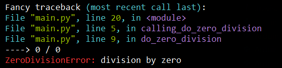

.. image:: https://img.shields.io/pypi/v/dvg-debug-functions
    :target: https://pypi.org/project/dvg-debug-functions
.. image:: https://img.shields.io/pypi/pyversions/dvg-debug-functions
    :target: https://pypi.org/project/dvg-debug-functions
.. image:: https://travis-ci.org/Dennis-van-Gils/python-dvg-debug-functions.svg?branch=master
    :target: https://travis-ci.org/Dennis-van-Gils/python-dvg-debug-functions
.. image:: https://coveralls.io/repos/github/Dennis-van-Gils/python-dvg-debug-functions/badge.svg?branch=master
    :target: https://coveralls.io/github/Dennis-van-Gils/python-dvg-debug-functions?branch=master
.. image:: https://img.shields.io/badge/code%20style-black-000000.svg
    :target: https://github.com/psf/black
.. image:: https://img.shields.io/badge/License-MIT-purple.svg
    :target: https://github.com/Dennis-van-Gils/python-dvg-debug-functions/blob/master/LICENSE.txt

DvG_debug_functions
===================
Provides functions for printing debug information to the terminal output.

dprint()
--------
::
  
  dprint(str_msg, ANSI_color=None) 

'Debug' print a single line to the terminal with optional ANSI color codes. The
line will be terminated with a newline character and the terminal output buffer
is forced to flush before and after every print. In addition, if PyQt5 is
present in the Python environment, then a mutex lock will be obtained and
released again for each dprint execution.

There is a lot of overhead using this print statement, but it is particularly
well-suited for multithreaded PyQt programs where multiple threads are each
printing information to the same terminal. The ``dprint()`` function ensures
that each line sent to the terminal will remain as a continious single line,
whereas a regular ``print()`` statement will likely result in the lines getting
mixed up.

tprint()
--------
::

  tprint(str_msg, ANSI_color=None) 

Identical to ``dprint()``, but now prepended with a ``time.perf_counter()``
timestamp.

print_fancy_traceback()
-----------------------
::

  print_fancy_traceback(err, back=3)

Print an Exception traceback or the current regular call stack to the terminal,
using ANSI color codes that mimic the IPython command shell.

    Args:
        err (``Exception`` | ``str`` | ``None``):
            When ``err`` is of type ``Exception``, then an Exception traceback
            will be printed. When ``err`` is of another type, then the current
            regular call stack will be printed.

        back (``int``):
            Depth of the traceback or call stack to print.

            Default: 3

Example output:

